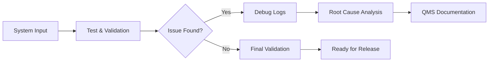

<h1 align="center">Sai Sri Vastsav Kokkirala</h1>

<h3 align="center">
Test Engineer • Systems Validation • Workflow Automation • Integration
</h3>

<p align="center">
Building reliable systems across hardware validation, production testing, workflow automation, APIs, cloud, and data.
</p>

<p align="center">
  <a href="https://srivastsav.github.io/Srivastsav/">
    
  </a>
  <a href="https://linkedin.com/in/sai-k-a97621388">
    
  </a>
  <a href="mailto:saisrivastsav7@gmail.com">
    
  </a>
</p>

---

## 🧭 Systems Dashboard

| Area | Focus |
|---|---|
| 🛠 Current Role | Production Testing & Systems Validation |
| ⚙️ Core Strength | Hardware diagnostics, firmware validation, failure analysis |
| 🔗 Integration Layer | REST APIs, OAuth2, workflow automation |
| ☁️ Cloud Layer | GCP IAM, Compute Engine, Monitoring |
| 📊 Data Layer | Python, SQL, Power BI, Tableau |
| 🧪 Validation Layer | Test logs, QMS documentation, root cause analysis |

---


## 🧠 Operating Model


    🛠 Tech Stack
<p align="center">  </p> <p align="center">       </p>


🚀 Featured Systems
Project	What It Shows
API Workflow Integration System	REST API design, validation, logging, and workflow reliability
HR Workflow Automation System	Power Platform, Dataverse, SharePoint, approval workflows
Operational Troubleshooting Framework	QMS records, debug logs, failure triage, root cause analysis
Contact Center Routing Optimization	Genesys Cloud Architect, routing logic, workflow configuration

📊 GitHub Activity
<p align="center">  </p> <p align="center">  </p>


🎯 Professional Positioning

I work at the intersection of:

Hardware Systems
    ↓
Testing & Validation
    ↓
Debugging & Root Cause Analysis
    ↓
Workflow Automation
    ↓
APIs, Cloud, Data, and Reporting

🌐 Connect
<p align="center"> <a href="https://srivastsav.github.io/Srivastsav/">Portfolio</a> • <a href="https://linkedin.com/in/sai-k-a97621388">LinkedIn</a> • <a href="mailto:saisrivastsav7@gmail.com">Email</a> </p> ```
